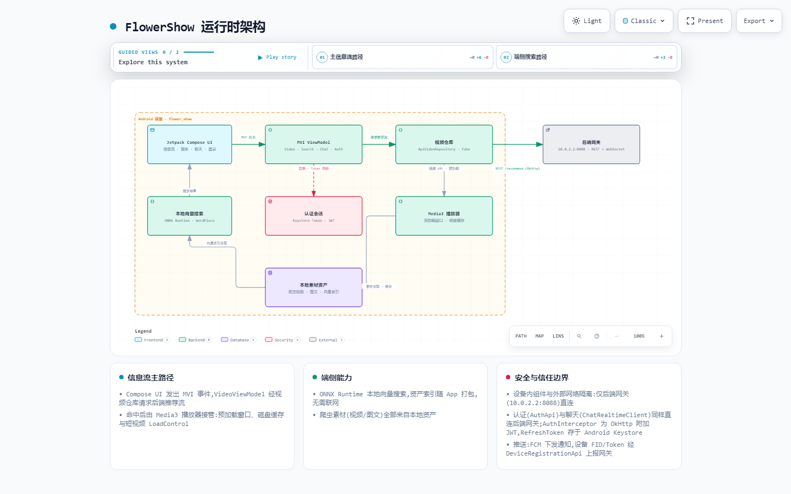

<p align="center">
  
</p>

<h1 align="center">FlowerShow</h1>

<p align="center">
  A short-video, visual-content, and social feed client built with Kotlin, Jetpack Compose, and AndroidX Media3.
</p>

<p align="center">
  <a href="./README.md">简体中文</a> · <strong>English</strong>
</p>

## Overview

FlowerShow is an Android project for short-form media browsing and social interaction. A single-activity Compose application connects to recommendation, search, authentication, relationship, comment, notification, and chat services through one configurable gateway. Its playback layer builds on Media3 with a shared player, disk cache, nearby-item preloading, quality switching, and observable performance metrics.

The repository also contains an on-device ONNX vector-search path and a local asset repository for offline experiments and tests. The current production path uses authenticated network repositories; on-device vector search is not the default production search implementation.

## Key capabilities

| Area | Capabilities |
|---|---|
| Feed | Recommended and following feeds, cursor pagination, mixed video/image/album cards, vertical paging |
| Playback | Media3 ExoPlayer, one shared player, progress seeking, playback speed, immersive landscape mode |
| Playback optimization | 500 MB LRU disk cache, nearby-window preloading, short-video LoadControl, position-preserving quality changes |
| Search | Server-backed search and suggestions, local history, paginated deduplicated results, jump back to selected content |
| On-device AI | ONNX Runtime, WordPiece tokenization, Chinese vector index, and lexical fallback for offline/experimental paths |
| Authentication | Sign-up, sign-in, session restoration, single/all-device logout, automatic 401 refresh, Keystore-encrypted refresh tokens |
| Social | Profiles, following/followers, likes, bookmarks, comments, post visibility, and notification read state |
| Messaging | Direct and group chat, paginated history, read receipts, video sharing, and group membership management |
| Realtime | WebSocket messaging with REST polling fallback and automatic reconnect |
| Push | Optional Firebase Cloud Messaging with build-time conditional registration and notification services |
| Performance | First-frame, buffering, cache, preload, quality-switch metrics, plus Macrobenchmark coverage |

## Runtime architecture

The GitHub page automatically selects the light or dark architecture preview for the current theme.

<picture>
  <source media="(prefers-color-scheme: dark)" srcset="./docs/archify/flowershow-runtime.architecture.visual-check.1440x900.dark.png" />
  <source media="(prefers-color-scheme: light)" srcset="./docs/archify/flowershow-runtime.architecture.visual-check.1440x900.light.png" />
  
</picture>

[Get the complete interactive architecture diagram](./docs/archify/flowershow-runtime.architecture.html) (GitHub README pages show the static preview only; download the HTML from its file page and open it in a browser). The diagram is a generated snapshot, so current source code remains authoritative for runtime configuration and implementation details.

### Main data flow

```text
Compose UI
   │ intents / user actions
   ▼
MVI ViewModel
   │ repository interfaces
   ├── Feed / Search / Social / Chat ──► Authenticated OkHttp ──► Gateway API
   ├── Chat realtime ──────────────────► WebSocket (REST polling fallback)
   └── Playback ───────────────────────► Media3 Player + Cache + Preload

Gateway Base URL
   ├── REST API:  {gateway}/api/v1
   ├── Media:     {gateway}/media
   └── WebSocket: ws(s)://{host}/ws/chat
```

## Technology stack

| Category | Technologies |
|---|---|
| Language and build | Kotlin, Gradle Wrapper, JDK 17 |
| UI | Jetpack Compose, Material 3, Compose Navigation |
| State | MVI-style Intent/State, Android ViewModel, StateFlow, Coroutines |
| Media | AndroidX Media3 / ExoPlayer, SimpleCache, DefaultPreloadManager |
| Network and realtime | OkHttp, REST, WebSocket, Gson |
| Images | Coil |
| On-device retrieval | ONNX Runtime Android, WordPiece, vector index |
| Security and push | Android Keystore, optional Firebase Cloud Messaging |
| Quality | JUnit, MockWebServer, Compose UI Test, Espresso, JaCoCo, Macrobenchmark |

Android configuration: `minSdk 28`, `compileSdk 35`, `targetSdk 35`, and application ID `com.example.flower_show`.

## Project structure

```text
flowershow/
├── app/
│   └── src/main/java/com/example/flower_show/
│       ├── ai/          # ONNX inference, tokenization, vector index, search suggestions
│       ├── config/      # Gateway, REST, media, and WebSocket endpoints
│       ├── data/        # Local data, APIs, auth, social, chat, repositories
│       ├── model/       # Feed, video, social, chat, and recommendation models
│       ├── player/      # Media3 player, cache, preloading, and LoadControl
│       ├── push/        # FCM messaging service and notifications
│       ├── ui/          # Compose screens, components, previews, and theme
│       ├── util/        # Performance metrics, diagnostics, experiment settings
│       └── viewmodel/   # Feed, search, auth, social, and chat MVI state
├── macrobenchmark/      # Cold start, first frame, feed, and quality benchmarks
├── docs/                # Architecture, performance, search, preprocessing, reading guides
└── tools/               # Performance collection and video preprocessing utilities
```

## Requirements

- Android Studio, or a working JDK 17 and Android SDK environment.
- Android SDK 35; the minimum runtime version is Android 9 (API 28).
- An Android device or emulator that can reach the configured gateway.
- A working `adb` connection for device tests, UI tests, and Macrobenchmark.

## Quick start

### 1. Clone the project

```powershell
git clone https://github.com/HGD-coder/FlowerShow.git
cd FlowerShow
```

### 2. Configure the backend gateway

`FLOWER_SHOW_PUBLIC_GATEWAY_BASE_URL` is the single public gateway setting. It can be supplied by `gradle.properties` or a command-line `-P` argument. When the property is absent, the build script falls back to:

```text
http://10.0.2.2:8088
```

`10.0.2.2` lets an Android emulator reach the host machine. After cloning, first inspect the environment value in `gradle.properties`; for a physical device, use a reachable LAN address or HTTPS domain. Override the value for a single build with:

```powershell
.\gradlew.bat :app:assembleDebug `
  -PFLOWER_SHOW_PUBLIC_GATEWAY_BASE_URL=https://your-domain.example.com
```

REST, media, and WebSocket endpoints are derived automatically from the gateway. Debug builds allow cleartext HTTP for local development; release builds use the secure network policy, so HTTPS/WSS is recommended for production.

### 3. Optional: enable Firebase Cloud Messaging

1. Create an Android app in Firebase Console with the exact application ID `com.example.flower_show`.
2. Download `google-services.json` to `app/google-services.json`.
3. Rebuild the app. Gradle applies the Google Services plugin only when this file exists.

Without Firebase configuration, FCM, device-token registration, and notification services are disabled, while the regular build and the feed, search, and chat code can still compile. Never commit service-account keys, private keys, or backend credentials.

### 4. Build and install

```powershell
# Build the Debug APK
.\gradlew.bat :app:assembleDebug

# Install on the connected device
adb install -r .\app\build\outputs\apk\debug\app-debug.apk
```

You can also run the `app` configuration directly from Android Studio.

## Tests and quality

```powershell
# JVM unit tests; the task also finalizes the JaCoCo report
.\gradlew.bat :app:testDebugUnitTest

# Android instrumentation and Compose UI tests; requires a device/emulator
.\gradlew.bat :app:connectedDebugAndroidTest

# Generate or refresh the JaCoCo report explicitly
.\gradlew.bat :app:jacocoTestReport

# Macrobenchmark; requires a device suitable for benchmark runs
.\gradlew.bat :macrobenchmark:connectedBenchmarkAndroidTest
```

The JaCoCo HTML report is written to `app/build/reports/jacoco/jacocoTestReport/html/index.html`. Macrobenchmarks cover cold start, video first frame, feed scrolling/buffering, and quality switching. Results must be collected on the target device; this README does not present design targets as measured results.

## Performance collection

`tools/perf-run.ps1` collects baseline and optimized sessions:

```powershell
.\tools\perf-run.ps1 -Suite single -Profile baseline -Runs 5 -ClearMode EveryRun
.\tools\perf-run.ps1 -Suite single -Profile optimized -Runs 5 -ClearMode EveryRun -SkipBuild -SkipInstall
```

The main signals include READY/first-frame/buffering time, cache hits, preload window state, LoadControl settings, and quality-switch recovery. See the [performance baseline guide](./docs/PERFORMANCE_BASELINE.md) for device requirements, collection steps, and metric definitions.

## Documentation

- [Code reading guide](./docs/CODE_READING_GUIDE.md)
- [Project technical documentation (Chinese)](./docs/FlowerShow%E6%8A%80%E6%9C%AF%E6%96%87%E6%A1%A3.md)
- [Performance baseline and Macrobenchmark](./docs/PERFORMANCE_BASELINE.md)
- [On-device vector search](./docs/LOCAL_VECTOR_SEARCH.md)
- [Video preprocessing](./docs/VIDEO_PREPROCESSING.md)
- [UI and storage course (Chinese)](./docs/course-02-ui-and-storage.md)
- [Networking and threading course (Chinese)](./docs/course-03-network-and-threading.md)
- [Performance, architecture, and AI course (Chinese)](./docs/course-04-performance-architecture-ai.md)
- [Runtime architecture HTML](./docs/archify/flowershow-runtime.architecture.html)

## Boundaries and security notes

- Recommended feed, production search, social, and chat features require a reachable backend gateway. `FakeVideoRepository` and on-device vector search are primarily offline experiment and test paths.
- Local asset files contain metadata; media URLs are served under the gateway's `/media` path. The legacy local `8081` media-server flow is no longer the default setup.
- FCM is optional and Firebase components remain disabled when `google-services.json` is absent.
- Refresh tokens are stored with Android Keystore-backed AES/GCM. Real credentials still must not be written to logs, client source, or the repository.
- Architecture diagrams and design documents may be generated snapshots. When they differ, current source, build scripts, and tests are authoritative.
