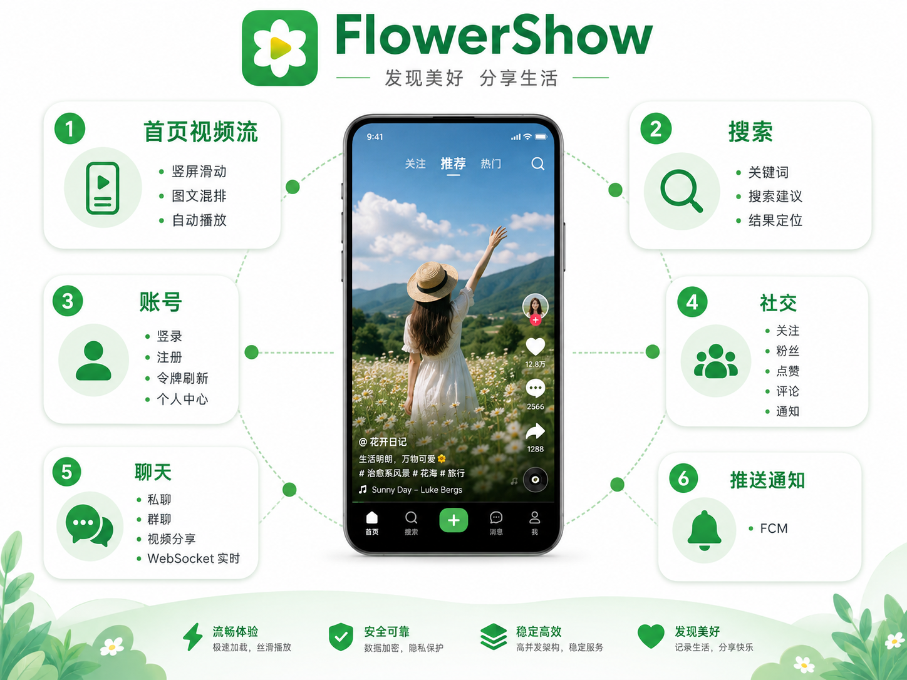
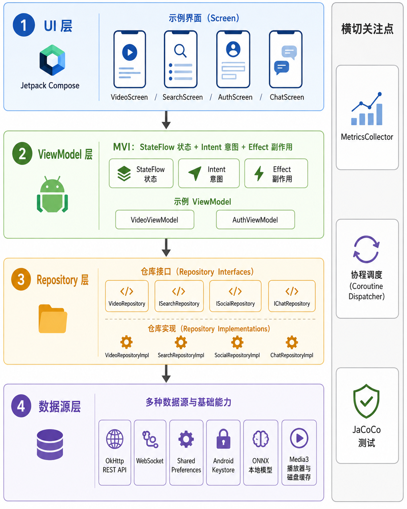
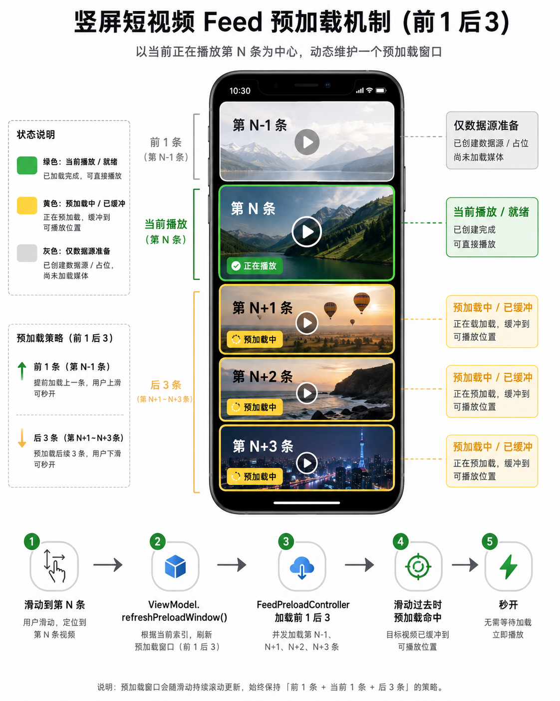
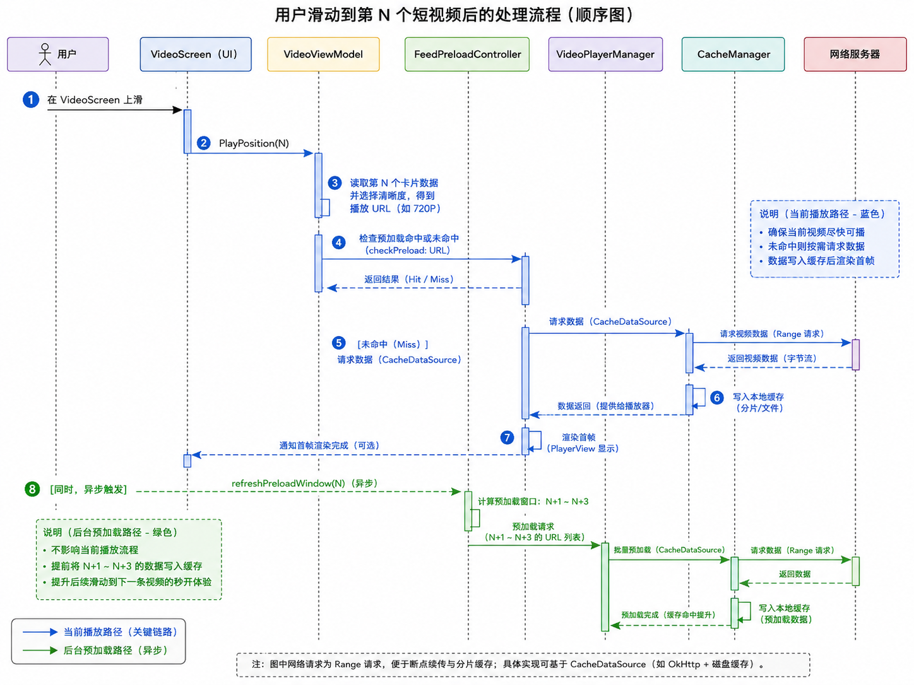
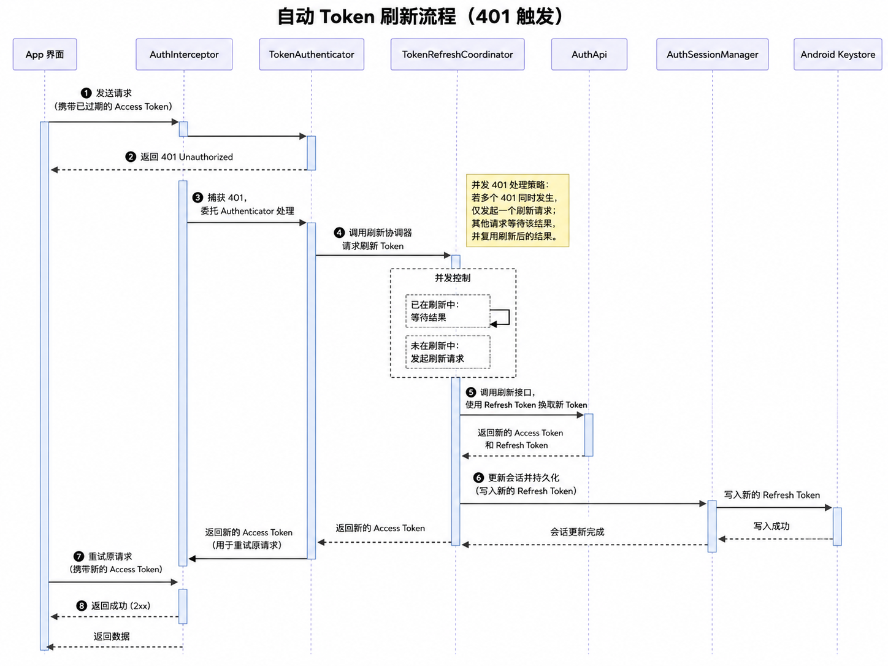
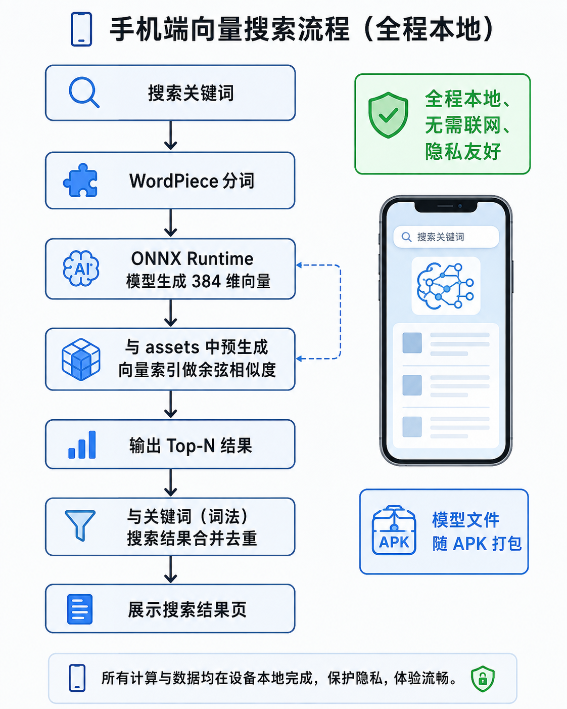
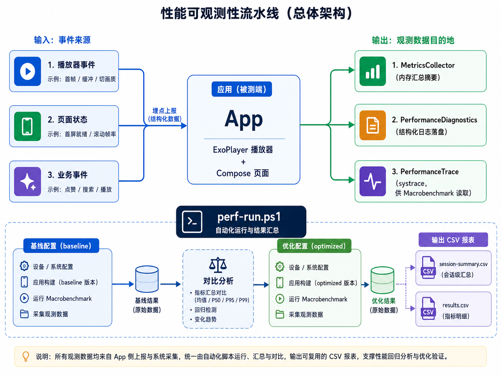
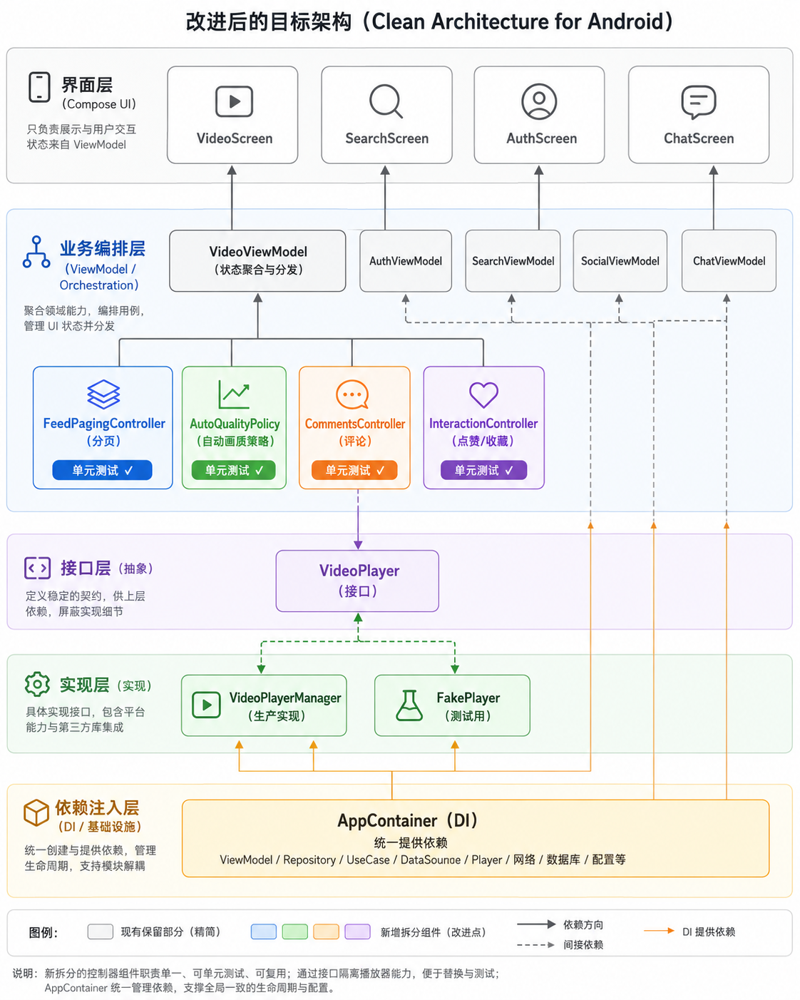

# FlowerShow 项目技术文档

> 文档版本：v1.0 ｜ 适用代码：`app/src/main`（主工程）+ `macrobenchmark`（性能基准）
> 本文面向"混合读者"：每章先用大白话建立直觉，再深入关键实现。第一次接触项目的同学可以从第 1、2 章读起；要上手改代码的同学重点看第 4 章；做方案评审的同学直接看第 6 章"改进意见"。
> 文中所有 `文件路径` 均相对于仓库根目录。

---

## 目录

1. [一分钟看懂这个项目](#第一章一分钟看懂这个项目)
2. [通俗版架构：先建立整体感觉](#第二章通俗版架构先建立整体感觉)
3. [模块地图：目录结构与职责](#第三章模块地图目录结构与职责)
4. [核心模块详解](#第四章核心模块详解)
   - 4.1 视频信息流与播放器（项目的心脏）
   - 4.2 账号体系与安全会话
   - 4.3 搜索与端侧 AI 推荐
   - 4.4 社交与互动
   - 4.5 聊天：私聊 + 群聊 + 实时消息
   - 4.6 推送通知（FCM）
   - 4.7 性能观测与实验体系
   - 4.8 依赖注入、构建与测试
5. [关键设计模式与约定](#第五章关键设计模式与约定)
6. [改进意见](#第六章改进意见)
7. [附录](#第七章附录)

---

## 第一章：一分钟看懂这个项目

### 1.1 这是什么 App？

**FlowerShow 是一个"短视频 + 图文"信息流应用的原型**，交互形态很像抖音/快手：打开就是全屏竖屏视频流，上下滑动切换，视频之间还混着单张图片卡片和图集卡片。它的素材来自本地爬虫数据（由一台局域网 HTTP 服务器提供），所以它更像是一个**验证播放体验和优化手段的"试验田"项目**，而不是一个追求上线的商业 App。

一句话概括它的价值：**用最贴近真实短视频 App 的工程结构，把"播放器怎么做快、缓存怎么做、画质怎么自动切"这件事研究透。**

### 1.2 技术栈一览

| 类别 | 选型 |
|---|---|
| 语言 / UI | Kotlin + Jetpack Compose（Material 3） |
| 架构 | 单 Activity + Compose Navigation + MVI（StateFlow） |
| 视频播放 | AndroidX Media3 / ExoPlayer（含 HLS、自定义 LoadControl） |
| 图片加载 | Coil |
| 网络 / 实时通信 | OkHttp（REST）+ OkHttp WebSocket（聊天） |
| 本地存储 | SharedPreferences + Android Keystore（加密令牌） |
| 端侧 AI | ONNX Runtime（本地向量检索 + WordPiece 分词） |
| 推送 | Firebase Cloud Messaging（可配置，缺文件时自动禁用） |
| 性能工程 | Macrobenchmark + JaCoCo + 自研埋点/实验开关 |
| 构建 | Gradle（Kotlin DSL + Version Catalog），JDK 17，minSdk 28 / targetSdk 35 |

### 1.3 功能地图

| 功能域 | 说明 | 入口代码（包） |
|---|---|---|
| 首页视频流 | 竖屏滑动、视频/图片/图集混排、自动播放 | `viewmodel/VideoViewModel.kt`、`ui/screen/VideoScreen.kt` |
| 播放增强 | 多清晰度、倍速、预加载窗口、500MB 磁盘缓存、自动切画质 | `player/*` |
| 搜索 | 关键词搜索、搜索建议、历史记录、结果定位跳回 | `viewmodel/SearchViewModel.kt`、`ai/*` |
| 账号 | 登录/注册/退出、access+refresh 双令牌、Keystore 加密、令牌自动刷新 | `data/auth/*`、`viewmodel/AuthViewModel.kt` |
| 社交 | 个人主页、他人主页、关注/粉丝、点赞/收藏/评论、通知 | `viewmodel/SocialViewModel.kt`、`data/remote/SocialApi.kt` |
| 聊天 | 私聊、群聊、实时收消息（WebSocket）、在聊天里分享视频 | `viewmodel/ChatViewModel.kt`、`data/remote/chat/*` |
| 推送 | FCM 注册 + 设备注册同步 | `push/*`、`data/push/*` |
| 性能观测 | 指标采集、诊断日志、systrace、baseline/optimized 对比 | `util/*`、`macrobenchmark/` |

### 1.4 项目里特别值得学习的地方

- **注释文化很好**：核心类都有中文注释，告诉你"先读哪个函数、这段逻辑是干什么的"，这在真实项目里非常罕见。
- **播放器优化是一套完整实验体系**：不是拍脑袋写死，而是通过 `PerformanceExperimentConfig` 做开关，用 `metrics + macrobenchmark + 脚本` 对比 baseline / optimized 两套配置。
- **安全的令牌存储**：refresh token 用 Android Keystore（AES-GCM）加密保存，且请求只在同源时才附带令牌。



> 📊 **给 ChatGPT 的图 prompt（功能全景图）**
>
> 生成一张软件功能全景信息图，主题是 Android 短视频应用 FlowerShow。画面中央是一台手机，周围用放射状布局画出 6 个功能模块并配小图标：① 首页视频流（竖屏滑动、图文混排、自动播放）② 搜索（关键词 + 搜索建议 + 结果定位）③ 账号（登录/注册/令牌刷新/个人中心）④ 社交（关注、粉丝、点赞、评论、通知）⑤ 聊天（私聊/群聊/视频分享，WebSocket 实时）⑥ 推送通知（FCM）。风格：扁平简洁、主色清新（绿/白），中文标签。

---

## 第二章：通俗版架构（先建立整体感觉）

### 2.1 用"奶茶店"来理解分层

把 App 想象成一家奶茶店：

| 角色 | 比喻 | 对应代码 |
|---|---|---|
| **门店前台** | 只负责接待、展示菜单、把客人点单喊出来 | Compose UI：`ui/screen/*`、`ui/component/*` |
| **店长** | 接收前台喊的单子，决定"先做哪杯、缺料怎么办、做完叫号" | ViewModel：`viewmodel/*` |
| **仓库管理员** | 店长不亲自去进货，只找仓库管理员要"货" | Repository：`data/repository/*` |
| **供应商 / 仓库** | 真正存放原料的地方（服务器、本地文件、数据库） | 数据源：`data/remote/*`、`data/local/*`、`assets/` |

一条铁律：**前台不能直接进仓库**。UI 永远通过店长（ViewModel）拿数据，店长永远通过仓库管理员（Repository）取数，仓库管理员才知道数据到底来自网络还是本地。这样哪一环想换掉（比如把本地素材换成真后端），只要改对应那一层就行。

### 2.2 打开 App 的那一瞬间发生了什么（通俗版）

1. 系统启动唯一的 `MainActivity`。
2. `MainActivity` 挂上 Compose 的 `AppNavigation`（导航图），默认进入**首页视频流**。
3. 首页的"店长"`VideoViewModel` 一出生就干两件事：**初始化播放器**、**向仓库管理员要第一页数据**。
4. 数据回来，界面渲染出第一条视频，播放器开始播放。
5. 你往上滑，店长一边让新视频播放，一边让"预加载小弟"提前把后面几条视频的数据下载好。
6. 你点搜索、点头像、点私信，导航图把界面切换到对应页面；需要登录的页面会先把你带到登录页，登录成功再把你送回原页面。

### 2.3 这种分层带来了什么好处

- **UI 很"傻"**：页面只根据 `state` 渲染，怎么渲染都行，不关心数据从哪来。
- **状态很"稳"**：所有变化都走 `StateFlow`，界面收到新状态就重组，不会出现"你改你的、我显示我的"。
- **替换很"容易"**：`FakeVideoRepository`（本地素材）和 `ApiVideoRepository`（真后端）实现同一个接口，切换数据源不影响上层。
- **测试很"方便"**：逻辑集中在 ViewModel 和纯函数里，不依赖屏幕，单元测试跑得快。



> 📊 **给 ChatGPT 的图 prompt（分层架构图）**
>
> 生成一张 Android MVVM + MVI 分层架构示意图，共 4 层，从上到下：**UI 层**（Jetpack Compose：VideoScreen / SearchScreen / AuthScreen / ChatScreen 等）→ **ViewModel 层**（MVI：StateFlow 状态 + Intent 意图 + Effect 副作用，例如 VideoViewModel、AuthViewModel）→ **Repository 层**（IVideoRepository / ISearchRepository / ISocialRepository / IChatRepository 等接口及实现类）→ **数据源层**（OkHttp REST API、WebSocket、SharedPreferences、Android Keystore、ONNX 本地模型、Media3 播放器与磁盘缓存）。层间用向下箭头标注依赖方向，右侧用一条竖线标注横切关注点：性能埋点 MetricsCollector、协程调度、JaCoCo 测试。中文标签，清晰简洁，颜色从浅到深表示层越底层。

### 2.4 一次视频播放请求的数据流（文字版）

```
VideoScreen（滑动到第 N 条）
   │  dispatch(VideoIntent.PlayPosition(N))
   ▼
VideoViewModel.playPosition(N)
   │  从 state.items 取出卡片，选定清晰度 URL
   ▼
VideoPlayerManager.play(url, ...)          ← 真正的 ExoPlayer 在这里
   │  若预加载命中 → 用已准备好的 MediaSource，秒开
   │  否则 → 走 CacheManager 缓存数据源 → 网络
   ▼
PlayerView（AndroidView 嵌入 Compose）渲染出画面
```

---

## 第三章：模块地图（目录结构与职责）

### 3.1 顶层目录

```text
flowershow/
├── app/                      # 主应用模块（所有功能都在这里）
│   └── src/
│       ├── main/             # 生产代码
│       ├── test/             # 单元测试（36 个文件）
│       └── androidTest/      # 仪器/Compose UI 测试（12 个文件）
├── macrobenchmark/           # 性能基准测试模块（冷启动/首帧/滚动帧率）
├── docs/                     # 既有文档 + 培训课程资料（见 7.4 节）
├── gradle/                   # Gradle 配置与版本目录
├── tools/                    # 性能采集脚本 perf-run.ps1
├── build.gradle.kts          # 根构建脚本
└── settings.gradle.kts       # 模块声明（:app 和 :macrobenchmark）
```

### 3.2 源码包结构（`app/src/main/java/com/example/flower_show/`）

| 包 | 通俗比喻 | 核心职责 | 核心类 |
|---|---|---|---|
| `viewmodel/` | 店长们 | MVI 状态机：接收 Intent、维护 State、驱动业务 | VideoViewModel、AuthViewModel、SearchViewModel、SocialViewModel、ChatViewModel |
| `ui/screen/` | 门店前台 | 各页面 Composable | VideoScreen、SearchScreen、AuthScreens、ProfileScreens、ChatScreen 系列 |
| `ui/component/` | 前台装饰 | 可复用 UI 组件 | ImageCard、AlbumCard、SlideProgressBar、FlowerIcons |
| `ui/theme/` | 装修风格 | 颜色/主题（Arctic/Aurora 两套配色） | Theme.kt、ArcticColors.kt、AuroraTokens.kt |
| `ui/preview/` | 样板间 | Android Studio 预览（Preview） | HomePreviews、AuthPagePreviews 等 |
| `data/repository/` | 仓库管理员 | 定义接口 + 给上层提供实现 | IVideoRepository、ApiVideoRepository、FakeVideoRepository、DefaultSocialRepository、RepositoryFactory |
| `data/remote/` | 供应商 | 网络 API 定义与 DTO | SocialApi、RecommendationApi、InstallIdProvider |
| `data/remote/chat/` | 供应商（聊天） | 聊天 REST + WebSocket | ChatApi、ChatRealtimeClient（含重连） |
| `data/auth/` | 门禁系统 | 登录、令牌、加密存储、自动刷新 | AuthGraph、AuthSessionManager、KeystoreRefreshTokenStore、TokenRefreshCoordinator |
| `data/local/` | 本地小仓库 | 本地素材读取、搜索历史 | AssetJsonLoader、SearchHistoryManager |
| `data/push/` | 传单系统 | FCM 设备注册同步 | PushRegistrationCoordinator、DeviceRegistrationApi |
| `player/` | 放映室 | 播放器、缓存、预加载、缓冲策略 | VideoPlayerManager、CacheManager、FeedPreloadController、ShortVideoLoadControl |
| `ai/` | 智能助手 | 端侧向量检索 + 搜索建议 | OnDeviceEmbeddingService、AssetVectorSearchIndex、SearchSuggestionEngine、WordPieceTokenizer |
| `model/` | 商品目录 | 数据模型与规则 | CardItem、VideoItem、VideoQualitySelector、Result |
| `util/` | 后勤部门 | 指标采集、诊断、实验配置、trace | MetricsCollector、PerformanceDiagnostics、PerformanceExperimentConfig、PerformanceTrace |
| `push/` | 传单分发 | FCM 消息接收与通知 | FlowerShowMessagingService、FlowerShowNotifications |
| `config/` | 路线图 | 后端地址集中配置 | NetworkConfig |

### 3.3 规模统计

- 生产代码（`main`）：**114 个 Kotlin 文件，约 2.2 万行**
- 单元测试（`test`）：**36 个文件，约 6.6 千行**
- 仪器测试（`androidTest`）：**12 个文件**（含 Compose UI 测试）
- 性能基准（`macrobenchmark`）：**1 个文件**
- 这是一个中等偏大的单体 Android 工程，**功能横向铺得很开，但架构骨架是清晰的**。

> 💡 为什么 114 个文件不算多？—— 因为所有功能都在 `app` 单模块里。商业级 App 通常还会拆出 `core`、`feature-xxx` 等模块。项目选择单模块是合理的，因为它是研究/原型性质的项目。

---

## 第四章：核心模块详解

### 4.1 视频信息流与播放器（项目的心脏）

#### 4.1.1 通俗引入

首页像一条"自动播放的传送带"。你看到的是：屏幕中央一个大视频，上滑换下一条。但背后其实是**四个岗位**在配合：

- **VideoScreen（前台）**：负责"摆放"视频画面、接收你的滑动操作。
- **VideoViewModel（店长）**：负责决定"现在该播哪条、下一条是什么、要不要加载更多、画质要不要自动切"。
- **VideoPlayerManager（放映员）**：真正操作 ExoPlayer，播放、暂停、换清晰度。
- **CacheManager / FeedPreloadController（后勤）**：提前把可能用到的视频数据下载/缓存好，让你滑动时"秒开"。

#### 4.1.2 关键类与职责

| 类 | 职责 | 关键点 |
|---|---|---|
| `viewmodel/VideoViewModel.kt` | 首页状态机：分页加载、定位播放、点赞/收藏/评论、自动画质 | 约 1450 行，功能最复杂的类 |
| `viewmodel/VideoState.kt` | 首页完整 UI 状态（不可变 data class） | `@Immutable`，用 `copy()` 更新 |
| `viewmodel/VideoIntent.kt` | UI 发来的"动作"（sealed interface） | 所有交互都翻译成 Intent |
| `player/VideoPlayerManager.kt` | 播放器封装：单例 ExoPlayer、缓存数据源、预加载、切画质、埋点 | 监听首帧/缓冲/错误并打点 |
| `player/CacheManager.kt` | 全局 500MB LRU 磁盘缓存（Media3 SimpleCache） | 单例，播放与预加载共享 |
| `player/FeedPreloadController.kt` | 用 Media3 `DefaultPreloadManager` 预加载相邻视频 | 前 1 条 + 后 3 条窗口 |
| `player/ShortVideoLoadControl.kt` | 三套短视频缓冲策略（FastStart/Balanced/RebufferGuard） | 比默认更激进的"尽快开播" |
| `ui/screen/VideoScreen.kt` | 首页 UI：VerticalPager + AndroidView(PlayerView) | 处理横屏、评论面板、分享 |
| `model/VideoQualitySelector.kt` | 清晰度选择与升降级规则（纯函数，易测试） | 供自动画质使用 |

#### 4.1.3 主流程时序（深入）

**① 冷启动加载第一页**

`VideoViewModel.init` → `playerManager.initialize()`（创建 ExoPlayer）+ `loadFirstPage()`。

`loadFirstPage` 在 `Dispatchers.IO` 请求推荐流（`loadRecommendedFeed`），成功后回主线程把 `items`、`deliveryContexts` 写入 `state`，然后立刻 `playPosition(0)` 播放第一条。每次加载首页都创建新的推荐会话（`RecommendedFeedLoadRequest.freshSession()`）。

**② 分页加载**

UI 在 `VerticalPager` 滑到接近末尾时发 `LoadNextPage`。`loadNextPage` 会用请求序号（`feedRequestGeneration`）做**防过期**：如果这次请求回来时用户已经切换了 feed 或重新加载，就丢弃结果。同时 `mergeFeedItems` 按内容身份（`video:/image:/album:` + id）**去重合并**，避免翻页时出现重复卡片。

**③ 定位播放**

`playPosition(position)` 是核心函数：

- 如果卡片是视频 → 选清晰度 URL，交给 `playerManager.play()`。
- 如果卡片是图片/图集 → 播放它的背景音乐；没有音乐就把播放器暂停（防止上一条视频的声音继续响）。

**④ 滑动与预加载**

`refreshPreloadWindow()` 以当前页为中心，取"前 1 条 + 后 3 条"构造 `VideoPreloadRequest`，交给 `FeedPreloadController`。控制器只负责"准备到可播放位置"，不会真的开始播放；等你滑过去时，`VideoPlayerManager.play()` 如果发现预加载命中，就**直接复用已准备好的 MediaSource**，实现"秒开"。

**⑤ 自动清晰度**

`VideoViewModel` 里内置了一套"网络感知"策略：

- **降清晰度**：连续卡顿次数 ≥ 2、单次卡顿 > 2s、或缓冲不足 + 带宽紧张 → 降一级（有 30s 冷却）。
- **升清晰度**：稳定播放 60s 以上、缓冲充足、带宽余量 ≥ 1.35 倍 → 升一级。
- 有 HLS 源时优先走 HLS 自适流（交给播放器自己切）。
- 所有切换都会记埋点（`auto_quality` 标签）。



> 📊 **给 ChatGPT 的图 prompt（预加载窗口）**
>
> 生成一张竖屏短视频信息流预加载机制示意图。中央一台手机，屏幕上是当前正在播放的第 N 条视频，上面是第 N-1 条，下面是第 N+1、N+2、N+3 条。用三种颜色区分状态：绿色 = 当前播放（已就绪）、黄色 = 预加载中（缓冲到可播放位置）、浅灰 = 仅准备数据源。下方画一条水平时间轴，标注："滑动到第 N 条 → ViewModel.refreshPreloadWindow() → FeedPreloadController 加载前 1 后 3 → 滑动过去时预加载命中 → 秒开"。中文标注。



> 📊 **给 ChatGPT 的图 prompt（播放时序图）**
>
> 生成一张 UML 时序图，展示用户滑动到第 N 条短视频后发生的事。参与者（泳道）：用户、VideoScreen（UI）、VideoViewModel、FeedPreloadController、VideoPlayerManager、CacheManager、网络服务器。消息流程：① VideoScreen 上滑 → ② PlayPosition(N) → ③ ViewModel 读取卡片并选定清晰度 URL → ④ 检查预加载（命中/未命中）→ ⑤ 未命中则经 CacheDataSource 请求网络 → ⑥ 数据写盘并返回 → ⑦ PlayerView 渲染首帧 → ⑧ 同时异步 refreshPreloadWindow 预加载 N+1..N+3。用不同颜色区分"当前播放路径"和"后台预加载路径"，中文标注。

#### 4.1.4 值得注意的设计细节

- **单例播放器**：整个 Activity 生命周期只创建一个 ExoPlayer，切换视频用 `setMediaSource` 替换，避免反复创建播放器的开销。
- **缓存共享**：播放器和预加载都用 `CacheManager` 的同一个 `SimpleCache`，数据不重复下载。
- **重复播放优化**：`play()` 里如果 URL 与当前相同且播放器非空闲，只恢复播放，不重建数据源。
- **切画质保进度**：`setQuality()` 用 `setMediaSource(newSource, position)` 保留当前播放进度。

---

### 4.2 账号体系与安全会话

#### 4.2.1 通俗引入

账号系统像一个**小区门禁**：进门要刷卡（access token），卡会过期，过期了要用备用钥匙（refresh token）去物业换新卡。物业为了防止钥匙被偷，把钥匙锁在保险柜里（Android Keystore 加密）。

#### 4.2.2 组件职责

| 类 | 职责 |
|---|---|
| `data/auth/AuthGraph.kt` | 全局"依赖容器"：创建所有认证相关对象（其实也是半个 DI 容器） |
| `data/auth/AuthSessionManager.kt` | 会话内存态：保存/读取当前 access/refresh token 与用户信息 |
| `data/auth/KeystoreRefreshTokenStore.kt` | 用 Android Keystore（AES-GCM）加密持久化 refresh token |
| `data/auth/AuthInterceptor.kt` | 给同源请求自动加 `Authorization: Bearer <token>` 头 |
| `data/auth/TokenAuthenticator.kt` | 收到 401 时触发"刷新 token 后重放请求" |
| `data/auth/TokenRefreshCoordinator.kt` | 令牌刷新协调：**并发 401 只刷新一次**，失败短暂去重 |
| `viewmodel/AuthViewModel.kt` | 登录/注册表单状态机 + 错误文案映射 |

#### 4.2.3 令牌生命周期

```
登录成功
  ├─ access token（短期）→ 内存，用于每个请求
  └─ refresh token（长期）→ Keystore AES-GCM 加密写入磁盘

某个请求返回 401
  └─ OkHttp Authenticator 捕获
       └─ TokenRefreshCoordinator.refreshAfterUnauthorized()
            ├─ 若同时间多个请求都 401 → 只发起一次刷新，其余复用结果
            ├─ 刷新成功 → 新 token 替换会话，原请求用新 token 重放
            └─ 刷新失败（401/403）→ 清空会话，要求重新登录
```

#### 4.2.4 安全设计的亮点

- **令牌不落明文**：refresh token 用 Keystore 生成的 AES-GCM 密钥加密后才写进 SharedPreferences，密钥无法从 App 里导出。
- **只在可信来源带令牌**：`AuthInterceptor` 用 `hasSameOrigin` 校验请求域名，避免向第三方域名泄漏令牌。
- **会话失效即清理**：刷新失败 401/403 时立即清空内存与磁盘会话。



> 📊 **给 ChatGPT 的图 prompt（令牌刷新时序图）**
>
> 生成一张 UML 时序图，展示"请求返回 401 后自动刷新令牌"的完整流程。参与者：App 界面、AuthInterceptor、TokenAuthenticator、TokenRefreshCoordinator、AuthApi、AuthSessionManager、Android Keystore。流程：① 携带过期 access token 发送请求 → ② 服务端返回 401 → ③ Authenticator 捕获 401 → ④ 调用 TokenRefreshCoordinator（同一时刻多个 401 只发起一次刷新，其余等待）→ ⑤ AuthApi.refresh 用 refresh token 换新令牌 → ⑥ AuthSessionManager 更新会话，新 refresh token 写入 Keystore → ⑦ 用新 token 重放原请求 → ⑧ 返回成功。UML 风格、中文标注。

---

### 4.3 搜索与端侧 AI 推荐

#### 4.3.1 通俗引入

搜索分两路：

- **关键词搜索（看得见）**：输入关键词，像查字典一样匹配标题/作者/标签。
- **语义搜索（看不见）**：把"关键词"和"视频标题"都转换成数学向量，算"意思像不像"。你说"浪漫的海边"，它能匹配到标题里没有"海边"但语义相近的视频。

语义搜索全部在**手机本地**完成（ONNX Runtime），不联网、不上传你的输入，这是它最大的亮点。

#### 4.3.2 组件职责

| 类 | 职责 |
|---|---|
| `viewmodel/SearchViewModel.kt` | 搜索状态机：提交搜索、猜你想搜、历史、分页 |
| `data/repository/LocalSearchRepository.kt` | 搜索仓库：历史存本地，结果/猜词委托网络仓库 |
| `data/local/SearchHistoryManager.kt` | 搜索历史（SharedPreferences，最多 20 条，JSON 存储 + 旧格式迁移） |
| `ai/SearchSuggestionEngine.kt` | 搜索建议/相关搜索生成（规则式，内置话题模板） |
| `ai/OnDeviceEmbeddingService.kt` | 用 ONNX 模型把文本转成向量（维度由 assets 的 manifest 声明，当前数据为 512 维） |
| `ai/WordPieceTokenizer.kt` | 中文/英文分词（WordPiece），喂给模型前处理 |
| `ai/AssetVectorSearchIndex.kt` | 从 assets 加载预生成的向量索引，做余弦相似度 |
| `ai/OnDeviceVectorSearchEngine.kt` | 向量搜索引擎入口：embed → 打分 → 兜底降级 |
| `data/repository/SearchMatcher.kt` | 文本相关度匹配（混合匹配器） |

#### 4.3.3 端侧向量检索流程

```
用户输入"浪漫的海边"
  → WordPieceTokenizer 分词 → token ids + attention mask
  → ONNX Runtime 推理 → 512 维向量（归一化，维度以索引 manifest 为准）
  → AssetVectorSearchIndex：与 assets 中每部视频的向量算余弦相似度
  → 返回 Top-N 分数
  → 与关键词搜索（词法匹配）结果合并 → 展示
```

模型（`assets/search/model.onnx`）和词表（`assets/search/vocab.txt`）以资源形式打包进 APK；模型不存在或推理失败时，**自动降级为纯关键词搜索**，不影响主流程。



> 📊 **给 ChatGPT 的图 prompt（端侧向量检索）**
>
> 生成一张手机端本地向量搜索流程图（flowchart）。起点是输入框"搜索关键词"，依次经过：WordPiece 分词 → ONNX Runtime 模型生成 384 维向量 → 与 assets 中预生成向量索引做余弦相似度 → 输出 Top-N 结果 → 与关键词（词法）搜索结果合并去重 → 展示搜索结果页。用绿色标注"全程本地、无需联网、隐私友好"，用蓝色标注"模型文件随 APK 打包"。中文标注，简洁扁平。

---

### 4.4 社交与互动

#### 4.4.1 功能范围

- **个人主页 / 他人主页**：展示头像、昵称、作品列表、作品可见性开关。
- **关注 / 粉丝**：关注列表、粉丝列表，支持查询过滤。
- **互动**：点赞、收藏（乐观更新 + 失败回滚）、评论（弹层、发表、计数联动）。
- **通知**：消息页的通知列表，支持已读/全部已读/分页加载。

#### 4.4.2 关键实现

- **乐观更新**（`VideoViewModel.toggleLike` / `toggleFavorite`）：先改本地界面（点赞数 +1），再发网络请求；请求失败就把界面**回滚**到之前的状态。用 `interactionRequests` 集合做"同一视频的同类请求去重"，防止快速连点时数据错乱。
- **评论数据按视频缓存**：`commentsByVideoId: Map<String, List<ContentComment>>`，每个视频的评论只加载一次。
- **关注关系决定 UI**：他人主页是否显示"发消息"按钮取决于 `profile.isMutual`（互关才显示）。

---

### 4.5 聊天：私聊 + 群聊 + 实时消息

#### 4.5.1 通俗引入

聊天 = **两条路**：

- **历史消息**：走普通 HTTP 接口，进聊天页先拉历史。
- **新消息**：走 WebSocket 长连接，服务器有新消息就"推"过来，不用反复刷新。

#### 4.5.2 关键实现

| 类 | 职责 |
|---|---|
| `data/remote/chat/ChatApi.kt` | 聊天 REST：会话列表、消息分页、建群、退群等 |
| `data/remote/chat/ChatRealtimeClient.kt` | WebSocket 客户端：连接状态机 + 指数退避重连 + 消息 ack |
| `data/repository/DefaultChatRepository.kt` | 聊天仓库：组装 REST + 实时事件 |
| `viewmodel/ChatViewModel.kt` | 聊天状态机：会话、草稿、发送重试、建群、分享视频 |

**实时客户端（`OkHttpChatRealtimeClient`）的设计细节：**

- **连接状态机**：`Disconnected → Connecting → Connected / Reconnecting`，通过 `StateFlow` 暴露给 UI 显示连接状态。
- **指数退避重连**：1s → 2s → 4s → … 上限 30s。
- **代际（generation）机制**：每次 `connect()/disconnect()` 都会使 generation +1，旧连接的异步回调通过 `isCurrent()` 校验被丢弃，避免"幽灵重连"。
- **消息确认（ack）**：收到实时消息后向服务器回 `ack`，保证可靠投递。
- **空实现（NoOp）**：未登录/功能关闭时使用 `NoOpChatRealtimeClient`，上层代码无需判空。

---

### 4.6 推送通知（FCM）

- `FlowerShowApplication` 在启动时检查 `BuildConfig.FIREBASE_CONFIGURED`：只有存在 `app/google-services.json` 才启用 Firebase。
- `FlowerShowMessagingService`（`push/`）接收 FCM 消息并展示通知。
- `PushRegistrationCoordinator`（`data/push/`）负责把 FCM 安装 ID 与登录用户绑定同步到服务端；用 `Mutex` 保证并发安全，支持"未登录先存 ID，登录后再补传"。

这个设计是**可选的**：没有 Firebase 配置也能正常构建运行，测试不受影响。

---

### 4.7 性能观测与实验体系

这一块是项目最有特色的部分，值得单独讲。

| 类 | 职责 |
|---|---|
| `util/PerformanceExperimentConfig.kt` | 实验开关（profile）：是否开缓存、是否开预加载、用哪套 LoadControl |
| `util/MetricsCollector.kt` | 轻量指标聚合（内存计数，供摘要输出） |
| `util/PerformanceDiagnostics.kt` | 结构化诊断日志：事件 + 耗时 + 属性，落盘/输出 |
| `util/PerformanceTrace.kt` | systrace 异步 trace 段（配合 Macrobenchmark 读取） |
| `macrobenchmark/.../FlowerShowPerformanceBenchmark.kt` | 冷启动、视频首帧、滚动帧率、切画质延迟 4 类基准 |
| `tools/perf-run.ps1` | 一键采集 baseline / optimized 两组数据并汇总 |

**工作方式：**

1. 通过 `-PFLOWER_SHOW_PUBLIC_GATEWAY_BASE_URL` 或代码里的 profile 切到不同"实验配置"。
2. 播放器埋点（首帧、缓冲、切画质、播放健康度）写入 Metrics/Diagnostics/Trace。
3. `perf-run.ps1` 跑 N 轮 baseline、N 轮 optimized，产出 `session-summary.csv` / `results.csv` 对比。
4. 用对比数据回答"预加载/新缓冲策略到底快了多少"。



> 📊 **给 ChatGPT 的图 prompt（性能观测体系）**
>
> 生成一张性能观测体系示意图。中央是 App（ExoPlayer 播放器 + Compose 页面）。左边三个输入源：播放器事件（首帧、缓冲、切画质）、页面状态（首屏就绪、滚动帧率）、业务事件（点赞、搜索、播放）。右边三个出口：MetricsCollector（内存汇总摘要）、PerformanceDiagnostics（结构化日志落盘）、PerformanceTrace（systrace，供 Macrobenchmark 读取）。底部标注 perf-run.ps1 脚本对比 baseline 与 optimized 两组配置的输出 CSV。用箭头表示数据流向，中文标注。

---

### 4.8 依赖注入、构建与测试

#### 4.8.1 依赖注入（手写 DI）

- **`data/auth/AuthGraph.kt`**：全局单例容器，创建 OkHttp 客户端（含认证拦截器）、会话管理、认证仓库、社交/聊天仓库、WebSocket 客户端、推送注册。它其实承担了"主 DI 容器"的角色。
- **`data/repository/RepositoryFactory.kt`**：按需懒加载的单例工厂，创建视频/社交/聊天/搜索仓库。
- 两者关系：`AuthGraph` 创建的组件优先；上层代码写的是 `authComponents.socialRepository ?: RepositoryFactory.getSocialRepository(...)`，即"容器里有就用容器的，没有就用工厂的"。

> ⚠️ 这里存在一个**架构瑕疵**（详见第 6 章 A3）：两条创建路径并存，同一个仓库可能被创建两次、配置还可能不一致。

#### 4.8.2 构建配置要点

- `app/build.gradle.kts`：
  - 存在 `google-services.json` 才应用 Firebase 插件（`firebaseConfigured` 变量）。
  - `PUBLIC_GATEWAY_BASE_URL` 可用 `-P` 参数覆盖，默认 `http://10.0.2.2:8088`（模拟器访问本机）。
  - 三种 buildType：`debug`（明文 HTTP + 覆盖率）、`release`（未开混淆 minify=false）、`benchmark`（用于 Macrobenchmark）。
  - 集成 JaCoCo，`testDebugUnitTest` 跑完自动出覆盖率报告。
- `settings.gradle.kts`：两个模块 `:app`、`:macrobenchmark`。

#### 4.8.3 测试体系

| 层级 | 数量 | 覆盖内容 | 示例 |
|---|---|---|---|
| 单元测试 `app/src/test` | 36 | 模型规则、认证、令牌刷新、聊天、搜索、视频策略、仓库、部分 ViewModel | TokenRefreshCoordinatorTest、VideoFeedSessionPolicyTest、ChatViewModelTest |
| 仪器测试 `app/src/androidTest` | 12 | Compose UI、导航、Keystore 存储 | AuthNavigationTest、UiNavigationTest、KeystoreRefreshTokenStoreTest |
| 性能基准 `macrobenchmark` | 1 | 冷启动/首帧/帧率/切画质 | FlowerShowPerformanceBenchmark |

> 💡 亮点：认证、聊天这类"容易出并发/边界 bug"的模块，单元测试覆盖相当扎实（TokenRefreshCoordinator 的并发合并、OkHttpChatRealtimeClient 的重连都测了）。

---

## 第五章：关键设计模式与约定

### 5.1 MVI 状态管理（几乎所有页面）

每个页面遵循统一套路：

```
UI 事件（点击/滑动）
   │  dispatch(Intent)
   ▼
ViewModel 处理（可能发网络请求）
   │  StateFlow<State>.update { ... }
   ▼
UI collectAsStateWithLifecycle() → 重组
```

- **State**：不可变 `data class`，标注 `@Immutable`。
- **Intent**：`sealed interface`，枚举所有用户动作，编译器保证 `when` 穷尽。
- **Effect**：一次性副作用（导航、Toast）通过 `effects` Flow 发送（如 ChatViewModel）。

### 5.2 单 Activity + Compose Navigation

- 整个 App 只有一个 `MainActivity`（`AndroidManifest.xml` 中唯一注册的 Activity）。
- 页面切换全部由 `NavHost` 完成，route 常量集中在 `MainActivity.kt` 的 `AppRoutes` 对象里。
- 需要登录的页面（个人页、消息、聊天等）通过 `AppRoutes.isProtected()` 判断：未登录先跳登录页，登录成功后回到 `pendingProtectedRoute`。

### 5.3 结果封装：`Result<T>`

所有仓库方法返回 `Result<T>`（`model/Result.kt`），包含 `Success / Error / Loading` 三种状态，上层用 `when` 穷尽处理，避免抛裸异常。

### 5.4 卡片模型：sealed interface

`CardItem` 用 sealed interface 表达三种卡片（视频/图片/图集），UI 用 `when` 分支渲染。新增卡片类型时编译器会强制检查所有 `when` 分支，避免漏改。

### 5.5 线程约定

- 网络/IO：`viewModelScope.launch(Dispatchers.IO)`。
- 更新 UI 状态：`withContext(Dispatchers.Main)` 回到主线程写 `StateFlow`。
- 播放器回调：在 `Looper.getMainLooper()` 上执行。

---

## 第六章：改进意见

> 说明：以下建议都基于真实代码给出（标注了文件位置）。我按"问题 → 为什么 → 怎么改"组织，并且给每一项标了优先级：
> - **P0**：现在就该做（影响正确性/可维护性，改动可控）
> - **P1**：尽快做（影响体验/工程质量，需要一定工作量）
> - **P2**：规划做（锦上添花，等主要问题解决后再说）

### 6.1 架构与代码质量（A 系列）

#### A1.【P0】`VideoViewModel` 太大，职责过载

- **位置**：`viewmodel/VideoViewModel.kt`（约 1450 行）
- **问题**：这个类同时管了"分页加载、播放定位、预加载窗口、自动画质策略、点赞、收藏、评论、事件上报"。任何一项改动都要动这个巨型类，测试也只能跟它死磕。
- **建议**：按职责拆成几个独立的、可单测的组件，`VideoViewModel` 只做"状态聚合与转发"：

```
VideoViewModel（瘦身：只管 State 聚合 + 分发）
 ├── FeedPagingController（分页/去重/会话）→ 现有 loadFirstPage/loadNextPage/mergeFeedItems
 ├── AutoQualityPolicy（自动画质决策）→ 现有 evaluateAutoQuality/applyAutoQualitySwitch/阈值
 ├── CommentsController（评论加载/提交）→ 现有 openComments/submitComment
 └── InteractionController（点赞/收藏乐观更新）→ 现有 toggleLike/toggleFavorite
```

拆分后每个组件都能写独立单测（比如"卡顿 2 次就该降级""带宽余量不足不升级"），比现在只能靠 `VideoFeedSessionPolicyTest` 间接测要直接得多。

#### A2.【P0】`VideoPlayerManager` 无法替换，播放器逻辑测不了

- **位置**：`viewmodel/VideoViewModel.kt` 第 86 行 `val playerManager = VideoPlayerManager(application)`
- **问题**：ViewModel 直接在构造函数里 `new` 播放器管理器，测试时没法注入假的播放器；`VideoPlayerManager` 本身深度依赖 Android 的 ExoPlayer，导致"播放/暂停/切画质"这套核心逻辑完全没有单元测试。
- **建议**：抽出 `VideoPlayer` 接口（`play/pause/resume/seekTo/setQuality/...`），`VideoPlayerManager` 作为它的生产实现；ViewModel 通过构造参数注入。测试时注入一个记录调用的假实现，就能断言"滑到第 N 条会调 play(URL)"这类行为。

#### A3.【P0】两套 DI 容器职责重叠，同一依赖可能被创建两次

- **位置**：`data/auth/AuthGraph.kt`、`data/repository/RepositoryFactory.kt`、`MainActivity.kt`（第 158-170 行）
- **问题**：
  - `AuthGraph` 已经能创建 `socialRepository`，但 `RepositoryFactory.getSocialRepository` 也会创建一份；
  - `MainActivity` 里 `authComponents.socialRepository ?: RepositoryFactory.getSocialRepository(...)` 这种"二选一"写法，让"这个 App 里到底有几个 SocialApi？"这个问题变得不可预测；
  - `RepositoryFactory.getOrCreateVideoRepository` 内部又去调 `AuthGraph.get(...).authenticatedClient`，容器之间互相依赖，初始化顺序难推理。
- **建议**：合并成一个 `AppContainer`（或让 `AuthGraph` 升级为唯一容器），所有依赖创建都收口到一处；`RepositoryFactory` 删除或只作为 `AppContainer` 的薄封装。这样"依赖从哪来"一眼可见，也方便将来引入 Hilt/Koin。

#### A4.【P1】业务/运营文案硬编码在代码里

- **位置**：`ai/SearchSuggestionEngine.kt`（`genericGuesses`、`inferByTopic` 的火影/王者/梅西/火锅等话题规则）
- **问题**：搜索建议词（"女武神m80"、"美年大健康优惠"）和话题模板是典型的**运营数据**，写死在代码里意味着改一个词就要发版。
- **建议**：抽到 `assets/suggestions.json`（或远端配置），运行时加载；代码只保留兜底逻辑。这样运营可配置、代码更干净。

#### A5.【P1】指标 key 用字符串拼接，缺少约束

- **位置**：`player/VideoPlayerManager.kt`（如 `MetricsCollector.record("video_startup|cached=$cached", latency)`）、各处的 `recordLabel` 字符串
- **问题**：字符串插值会撑大 key 空间（`cached=true/false` 是两个 key），拼写错误编译期发现不了，统计口径难统一。
- **建议**：集中定义指标常量（如 `MetricKey.VideoStartup`），或用结构化字段（`mapOf("cached" to true)`）代替 key 拼接。至少把所有 key 收敛到一个 `MetricKeys.kt`。

#### A6.【P1】点赞与收藏逻辑重复

- **位置**：`viewmodel/VideoViewModel.kt` 的 `toggleLike` 与 `toggleFavorite`（几乎逐行重复：乐观更新 → 请求去重 → 失败回滚）
- **建议**：抽一个 `runInteraction(contentId, requestKey, optimistic: (Item) -> Item, network: suspend (Boolean) -> ContentStats)` 泛型函数，点赞/收藏各自只提供差异部分。

#### A7.【P1】`MainActivity.kt` 一文件多职责（830+ 行）

- **位置**：`MainActivity.kt`
- **问题**：Activity + `AppNavigation` + `AppRoutes` + 7 个导航扩展函数全在一个文件里，导航相关代码占了大部分。
- **建议**：拆成 `MainActivity.kt`（生命周期）、`navigation/AppNavigation.kt`（NavHost）、`navigation/AppRoutes.kt`（route 常量）、`navigation/NavExt.kt`（扩展函数）。顺带可以用 **Navigation 测试**（`androidx.navigation:navigation-testing`）验证 route 逻辑。

#### A8.【P2】`AuthGraph` 放错包、命名误导

- **位置**：`data/auth/AuthGraph.kt`
- **问题**：它实际是"全局依赖容器"，却放在 `data/auth` 包、名字像"认证图"。新人容易误以为它只属于认证。
- **建议**：移到 `di/AppContainer.kt` 或 `core/di/`，职责与命名相符。

#### A9.【P2】包名/工程名/应用名不一致

- **位置**：包名 `com.example.flower_show`、工程 `flower-show`、应用 `FlowerShow`
- **问题**：下划线 vs 连字符 vs 驼峰混用，虽然不影响运行，但观感杂乱；`com.example` 前缀也不适合最终上架。
- **建议**：如果将来要发布，统一 applicationId 与命名规范。

#### A10.【P2】`CardItem.itemType` 的建模略绕

- **位置**：`model/CardItem.kt`
- **问题**：`itemType` 的类型是 `CardItem` 本身（`data object TypeVideo` 作为它自己的类型标记），"类型描述自己"会让 `when(card.itemType)` 的语义不如枚举直观。
- **建议**：改为 `enum class ItemType { VIDEO, IMAGE, ALBUM }`，`CardItem` 暴露 `val itemType: ItemType`。改动小、可读性更好。

### 6.2 性能与体验（P 系列）

#### P1.【P1】冷启动关键路径偏重

- **位置**：`FlowerShowApplication.onCreate`（注册 FCM）、`VideoViewModel.init`（立即 `playerManager.initialize()` + `loadFirstPage()`）
- **问题**：Application 启动即做 FCM 注册、ViewModel 创建即初始化 ExoPlayer 并拉数据，这些都在首屏绘制关键路径上，会让冷启动变慢。
- **建议**：
  1. 用 macrobenchmark 的 `coldStartup` 数据确认瓶颈；
  2. 把播放器初始化延迟到首帧绘制后（配合 `reportDrawn` 时机）；
  3. FCM 注册保持在后台线程（现在已是 `Dispatchers.Default`，可保留）。
  4. 配合 P2 的 Baseline Profile 效果更明显。

#### P2.【P1】增加 Baseline Profile（启动/滚动提速利器）

- **位置**：`macrobenchmark/` 模块已存在
- **问题**：项目引入了 `androidx.profileinstaller` 且有 benchmark 构建类型，但**没有生成 Baseline Profile** 并打包进 release。
- **建议**：在 `macrobenchmark` 里加一个 `BaselineProfileGenerator`（`@RunWith(AndroidJUnit4::class)` + `BaselineProfileRule`，跑一遍首页启动+滚动），产物放进 `app/src/main/baseline-prof.txt`。通常能显著减少冷启动编译开销。

#### P3.【P1】`jumpToVideo` 无上限地翻页找目标视频

- **位置**：`viewmodel/VideoViewModel.kt` 的 `jumpToVideo`
- **问题**：从搜索结果跳转时，如果目标不在已加载列表，代码会**一页一页翻目录直到找到**（`while (!found)`），没有页数上限。冷门内容可能翻几十页、消耗大量流量和时间；而且翻页过程中 `deliveryContexts` 被置为全 null，后续推荐埋点数据丢失。
- **建议**：① 限制最多翻 N 页（如 5），找不到就提示"内容较久远，请重新搜索"；② 服务端提供"按 id 查内容位置"接口（或直接支持 id 直达播放）；③ 保留各页 deliveryContext。

#### P4.【P1】评论一次性全量加载

- **位置**：`viewmodel/VideoViewModel.openComments`（`repository.loadComments(videoId)` 一次性返回全部）
- **问题**：高评论量视频会把大量数据一次性拉回内存，首屏也慢。
- **建议**：改为游标分页，弹层滚动到底时 `LoadMoreComments`。

#### P5.【P1】自动画质阈值硬编码

- **位置**：`viewmodel/VideoViewModel.kt` 的 `companion object`（`BUFFERING_WINDOW_MS`、`STABLE_UPGRADE_MS`、`COOLDOWN_MS` 等 10 个常量）
- **问题**：这些参数是体验调优的关键旋钮，写死不利于 A/B。
- **建议**：并入 `PerformanceExperimentConfig`（项目已有实验配置体系），这样 baseline/optimized 对比可以连"画质策略参数"一起测。

#### P6.【P2】图片卡片不在预加载窗口内

- **位置**：`viewmodel/VideoViewModel.refreshPreloadWindow`（只处理 `VideoItem`）
- **问题**：信息流里混排的图片/图集卡片没有做图片预取，快速滑动时图片可能白屏一下。
- **建议**：对相邻的 `ImageCardItem` / `AlbumCardItem` 封面用 Coil 做内存预热（`ImageLoader.enqueue` 提前加载到内存缓存），代价小、体感提升明显。

#### P7.【P2】页面销毁时在主线程写文件

- **位置**：`viewmodel/VideoViewModel.onCleared`（`File(...).writeText(report)`）
- **问题**：`onCleared` 在主线执行，`writeText` 是同步磁盘 IO（文件小，通常没事，但属于"可以避免的卡顿源"）。
- **建议**：改用 `Dispatchers.IO` 异步写入，或交给 `PerformanceDiagnostics` 统一异步处理。

#### P8.【P2】通知权限每次冷启动都弹

- **位置**：`MainActivity.requestNotificationPermissionIfNeeded()`（onCreate 就请求，Android 13+）
- **问题**：每次冷启动都弹权限框，用户可能反感。
- **建议**：在用户主动进入"消息/通知"相关页面、或第一次打开 App 的合适时机再请求；也可记录"已拒绝过"避免反复打扰。

#### P9.【P2】预加载窗口大小固定

- **位置**：`viewmodel/VideoViewModel` 的 `PRELOAD_BEHIND_COUNT=1 / PRELOAD_AHEAD_COUNT=3`，`player/FeedPreloadController` 内部还有 `NEXT_VIDEO_PRELOAD_MS=2500`
- **建议**：可依据网络类型（Wi-Fi 多预加载、移动网络少预加载）和设备内存动态调整，进一步省流量、控内存。

#### P10.【P2】端侧模型体积与加载时机

- **位置**：`ai/OnDeviceEmbeddingService.kt`（首次使用从 assets 拷贝到 cacheDir）
- **建议**：模型若较大，可在安装后/空闲时预热；同时检查 `cacheDir` 被系统清理后重新拷贝的成本。当前逻辑每次冷启动 lazily 拷贝，可接受，但值得留意。

### 6.3 工程化与测试（T 系列）

| 编号 | 优先级 | 建议 |
|---|---|---|
| T1 | P1 | 播放器逻辑目前没有单元测试（A2 抽接口后补上），自动画质策略也应直接单测 |
| T2 | P1 | `jumpToVideo` 翻页查找、`refreshPreloadWindow` 边界（首条/末条/空列表）建议补测试 |
| T3 | P2 | JaCoCo 覆盖率已配置，可在 CI 上加"覆盖率门禁"（低于阈值报警） |
| T4 | P2 | `tools/perf-run.ps1` 是 Windows PowerShell 脚本，可考虑补一份 CI 可跑的 Gradle 任务，把 baseline/optimized 对比自动化 |
| T5 | P2 | 若继续扩大功能，考虑拆分 `core` / `feature-*` 模块，编译隔离，加快增量构建 |

### 6.4 建议的落地顺序

| 批次 | 内容 | 理由 |
|---|---|---|
| **第一批（治本）** | A1 拆分 VideoViewModel、A2 播放器接口、A3 统一 DI | 三个改动互相咬合，一起做收益最大，之后每个模块都能独立演进 |
| **第二批（提效）** | P1/P2 启动优化 + Baseline Profile、A7 导航拆分、A6 去重 | 让 App 更快、让代码更好维护 |
| **第三批（体验）** | P3 翻页上限、P4 评论分页、P6 图片预加载、P9 动态预加载 | 直接提升用户可感知的流畅度 |
| **第四批（收尾）** | A4 文案外置、A5 指标收敛、A8/A9/A10 命名与建模、T3/T4 CI 门禁 | 多为一致性/工程化打磨 |

### 6.5 改进后的目标架构（图 prompt）



> 📊 **给 ChatGPT 的图 prompt（改进后的目标架构）**
>
> 生成一张改进后的 Android 架构图（clean architecture 风格）。外层是 Compose UI（VideoScreen、SearchScreen、AuthScreen、ChatScreen），中间是"业务编排层"（VideoViewModel 瘦身后只做状态聚合与分发，AuthViewModel / SearchViewModel / SocialViewModel / ChatViewModel 各自独立）。将 VideoViewModel 下方展开画出四个新拆分组件：FeedPagingController（分页）、AutoQualityPolicy（自动画质策略）、CommentsController（评论）、InteractionController（点赞/收藏），每个组件旁边标注"单元测试 ✓"。播放器通过 VideoPlayer 接口注入，接口下方是 VideoPlayerManager 与 FakePlayer（测试用）。底部是统一的 AppContainer（DI），向所有层提供依赖。用灰色表示现有保留部分、彩色表示本次新增拆分部分，中文标注。

---

## 第七章：附录

### 7.1 常用命令

```powershell
# 构建 Debug APK
.\gradlew.bat :app:assembleDebug

# 跑单元测试（跑完自动出 JaCoCo 覆盖率）
.\gradlew.bat :app:testDebugUnitTest

# 跑仪器测试（需要真机/模拟器）
.\gradlew.bat :app:connectedDebugAndroidTest

# 跑性能基准（需要真机，Pixel/模拟器，不要 vivo 用户版）
.\gradlew.bat :macrobenchmark:connectedDebugAndroidTest

# 用自定义网关地址构建（模拟器默认 http://10.0.2.2:8088）
.\gradlew.bat :app:assembleDebug -PFLOWER_SHOW_PUBLIC_GATEWAY_BASE_URL=https://your-domain.example.com

# 采集性能数据（baseline 5 轮 + optimized 5 轮）
.\tools\perf-run.ps1 -Suite single -Profile baseline -Runs 5 -ClearMode EveryRun
.\tools\perf-run.ps1 -Suite single -Profile optimized -Runs 5 -ClearMode EveryRun -SkipBuild -SkipInstall
```

### 7.2 本地调试前置条件

1. 启动素材服务器（README 指向 `D:\MediaCrawler\MediaCrawler\start_video_server.bat`）。
2. 真机调试时确认 `AssetJsonLoader` 里的 `LAN_IP` 与电脑局域网 IP 一致。
3. 启用推送需要把 Firebase Console 下载的 `google-services.json` 放到 `app/` 目录（缺省时推送自动禁用）。

### 7.3 术语表

| 术语 | 解释 |
|---|---|
| Feed | 信息流，首页一页一页的卡片列表 |
| MVI | Model-View-Intent：以"状态 + 意图"为中心的界面架构 |
| ViewModel | AndroidX 生命周期组件，页面状态与业务逻辑的宿主 |
| StateFlow | 协程版"可观察状态"，UI 订阅它来刷新 |
| ExoPlayer / Media3 | Google 的媒体播放库，项目的播放内核 |
| HLS | 自适应码率流协议，播放器可自动切换清晰度 |
| 预加载 | 提前下载/准备即将播放的内容 |
| LRU 缓存 | 淘汰最久未使用数据的缓存策略 |
| Refresh Token | 长期有效、用于换取新 access token 的凭据 |
| Keystore | Android 系统级密钥存储，密钥不可导出 |
| 向量检索 | 把文本映射成向量，用相似度做语义匹配 |
| ONNX Runtime | 在手机上运行机器学习模型的推理引擎 |
| WebSocket | 全双工长连接，服务器可主动推消息 |
| Baseline Profile | 预编译热路径指令的清单，加速启动与渲染 |
| JaCoCo | Java/Kotlin 代码覆盖率工具 |

### 7.4 项目既有文档

`docs/` 目录下还有几份历史文档，可与本文配合阅读（本文是"全景"视角，旧文档偏"专题"）：

| 文件 | 主题 |
|---|---|
| `docs/PROJECT_DOCUMENTATION.md` | 早期项目总文档 |
| `docs/CODE_READING_GUIDE.md` | 代码阅读指引 |
| `docs/PERFORMANCE_BASELINE.md` | 性能基线说明 |
| `docs/LOCAL_VECTOR_SEARCH.md` | 本地向量搜索说明 |
| `docs/VIDEO_PREPROCESSING.md` | 视频素材预处理说明 |
| `docs/course-02/03/04-*.md` | Android 培训课程课件（与 App 代码无依赖） |

### 7.5 全项目图示 prompt 汇总

本文档一共提供了 **8 张图**的生成 prompt，方便你在 ChatGPT / 其他绘图工具中生成图示：

| # | 图 | 位置 |
|---|---|---|
| 1 | 功能全景图 | 第 1.4 节 |
| 2 | 分层架构图 | 第 2.3 节 |
| 3 | 预加载窗口示意图 | 第 4.1.3 节 |
| 4 | 播放时序图 | 第 4.1.3 节 |
| 5 | 令牌刷新时序图 | 第 4.2.4 节 |
| 6 | 端侧向量检索流程图 | 第 4.3.3 节 |
| 7 | 性能观测体系图 | 第 4.7 节 |
| 8 | 改进后的目标架构图 | 第 6.5 节 |

---

*本文档由 Claude 依据仓库代码整理而成，所有类名、包名、文件路径均与 `app/src/main` 一致；若代码后续改动，请同步更新本文。*
